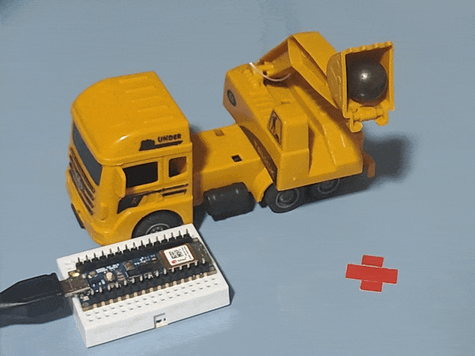
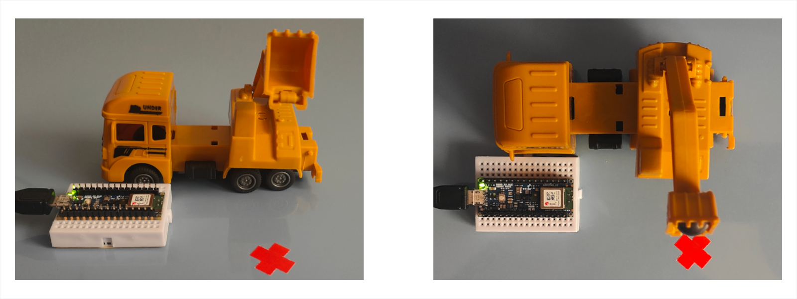
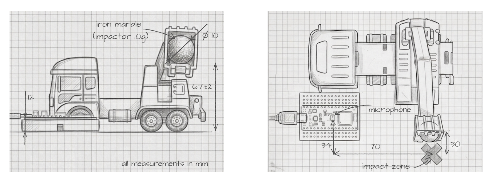

# Acoustic Hardness Classification With TinyML

Real-time audio-based surface hardness classification running on the Arduino Nano 33 BLE Sense Rev 2.

By analyzing the acoustic response of impacts, this project classifies material surfaces into three hardness categories: **soft**, **medium**, and **hard**.

<!-- Project Hero GIF -->

  
  
<i>The "Impactor Releaser Device" (toy excavator) dropping a marble onto the impact zone on the target surface.</i>

> **HARDNESS NOTE:** Throughout this project, the term **hardness** is used for simplicity. The classification is not a direct measurement of material hardness; instead, it is based on the acoustic response produced when an object impacts a surface, which reflects a combination of the surface's mechanical and acoustic properties.

---

## Project Overview

This project implements an end-to-end machine learning pipeline on a microcontroller:

1. **Phase 1: Feasibility Validation** ✅
   - Collect pilot audio samples across 3 hardness classes
   - Validate acoustic separation via signal analysis
   - Confirm classification viability

2. **Phase 2: Data Collection**
    (TBD)

3. **Phase 3: ML Pipeline**
    (TBD)
    
4. **Phase 4: Embedded Deployment**
    (TBD)

---

## Key Results & Findings

(TBD)

---

## Hardware

- **Board:** Arduino Nano 33 BLE Sense Rev 2
- **Microcontroller:** Nordic nRF52840 64MHz
- **Sensors:** 
  - MP34DT06JTR PDM Microphone (audio input)
  - BMI270 + BMM150 IMU (auxiliary)
- **Drop System:** Impactor Releaser Device (~7cm fixed height, 1cm ~10g iron marble)

<!-- Real Setup Photos -->
<h3 align="center">Physical Data Collection Hardware</h3>

  

 

<!-- Technical Blueprints -->
<h3 align="center">Impactor Releaser Device - Schematic Blueprints (X-Z & X-Y Planes)</h3>

  

---

## Methodology

### Classification Task
- **Soft:** Low-energy, quick decay
- **Medium:** Moderate energy, partial damping
- **Hard:** High-energy, sustained ringing 

### Acoustic Setup
- **Sampling Rate:** 16 kHz
- **Recording Duration:** 2.5 seconds per impact
- **Trigger:** Sound amplitude threshold-based capture
- **Pre-trigger Buffer:** 50ms (ambient baseline)
- **Post-trigger Window:** 2.45s

### Data Collection Workflow

1. **Initial Setup:** Connect the Arduino to the PC and execute `collect.py` (or the compiled executable).
2. **Metadata Input:** `collect.py` prompts for metadata (material name, class/label, comments).
4. **Confirm Readiness:** `collect.py` prompts whether user is ready to take the sample.
5. **Acoustic Trigger:** Release the impactor. 
6. **Arduino Routine:** `recorder.ino` detects the threshold breach, and streams the data over the Serial port.
7. **Data Processing:** `collect.py` reads and validates the stream, saving the data as a unique UUID-named JSON file.
8. **Session Management:** `collect.py` prompts whether to continue (loops back to **step 2** or exits).

---

## Tech Stack

**Core Framework & Training:**
- TensorFlow — Deep learning framework

**Utilities:**
- NumPy, Pandas — Data manipulation and analysis
- Matplotlib — Visualization

**Development:**
- Black — Code formatting
- Flake8 — Linting
- Pytest — Unit testing

---

## Folder Structure

(TBD)

---

## How to Run

(TBD)

---

## Citations & References

- [Arduino Official Page](https://www.arduino.cc/)
- [Arduino Docs](https://docs.arduino.cc/)
- [Nano 33 BLE Sense Rev2 Docs Page](https://docs.arduino.cc/hardware/nano-33-ble-sense-rev2/)

---

## Contact

For questions reach out via GitHub (Kev-HL).
